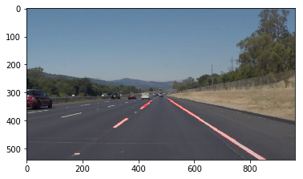

**Finding Lane Lines on the Road**

This is the first project in the Udacity Self-Driving Car NanoDegree. In this project, the goal is to develop a lane detection algorithm. I've accomplished this by making use of the Python OpenCV library. In particular, I've made use of the Canny Edge Detection and Hough Line Transform algorithms. As output in this project, I annotated several images, indicating where the lanes lie within the photos. Similarly, I've done the same for video input, which gets processed as a series of videos. 

---

### Reflection

### 1. Describe your pipeline. As part of the description, explain how you modified the draw_lines() function.

Step 1: Read in the image
Step 2: Convert the image to grayscale
Step 3: Perform Gaussian smoothing on the image
Step 4: Run the Canny edge detection algorithm on the image
Step 5: Perform a bitwise and to mask all white edges in the image
Step 6: Run the Hough line transform algorithm on the image
Step 7: Extract only the lines which fall in our region of interest 

### 2. Identify potential shortcomings with your current pipeline

Until I ran my code on the provided challenge video, I felt very confident about my solution. However, the challenge video brought several flaws to my attention. <<extrapolate>>

### 3. Suggest possible improvements to your pipeline

Possible improvements:

### Results: 

You can find my annotated images in the test_images_output folder. The annotated videos are located in the test_videos_output folder.
