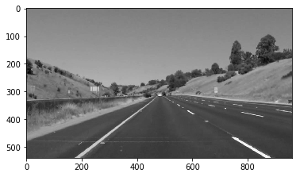

# Finding Lane Lines on the Road

This is the first project in the Udacity Self-Driving Car Nanodegree. In this project, the goal was to develop a lane detection algorithm similar to those used by autonomous vehicles. I've accomplished this by making use of the Python OpenCV library. Among others, I've employed the Canny Edge Detection and Hough Line Transform algorithms. In this writeup, I've outlined my image transformation step by step, showing the outputs along the way. 

---

### Reflection

### 1. Describe your pipeline. As part of the description, explain how you modified the draw_lines() function.

1. Read in the image

2. Convert the image to grayscale

3. Perform Gaussian smoothing on the image
4. Run the Canny edge detection algorithm on the image

5. Perform a bitwise and to mask all white edges in the image
6. Run the Hough line transform algorithm on the image

7. Remove noise outside our region of interest 

8. Overlay the result on our original image

### 2. Identify potential shortcomings with your current pipeline

Imagine that a white car were to drive directly in front of me. As my pipeline is currently defined, the outlines of that white car would likely be returned as lane markings. 
The images and videos we were presented with are fairly "clean" representations of highway space. In real life, there are so many factors that can complicate this problem. I'll mention some of those complications in the next section. 

### 3. Suggest possible improvements to your pipeline

The challenge video presents a number of scenarios that test the capacity of my pipeline. In particular, it shows that my pipeline could be improved by improving its robustness in challenging environments. Challenging environments include any sort of conditions that result in color changes within the image (e.g. rain, snow, darkness). Other challenges might involve sharp turns in a road, missing lane delineators, or debris. 
An improved pipeline would solve for challenges like these, and would have mechanisms in place to ensure accuracy and robustness in all possible conditions. 

### Results: 

You can find annotated image results for all provided inputs in the test_images_output folder. The annotated videos are located in the test_videos_output folder.
